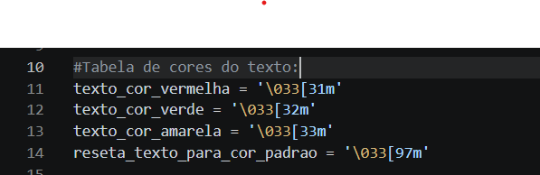
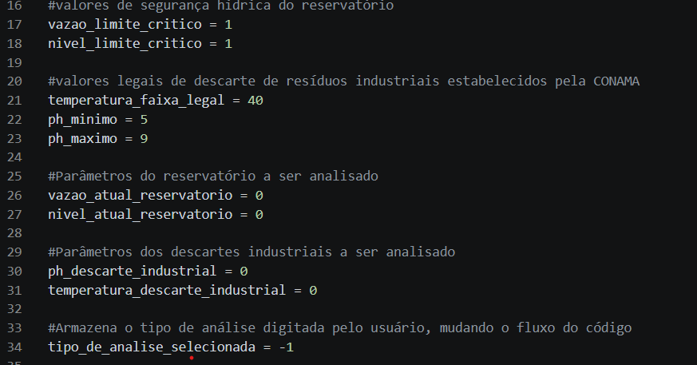
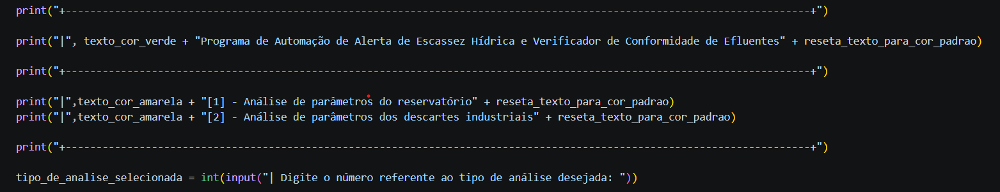
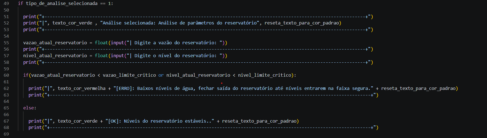
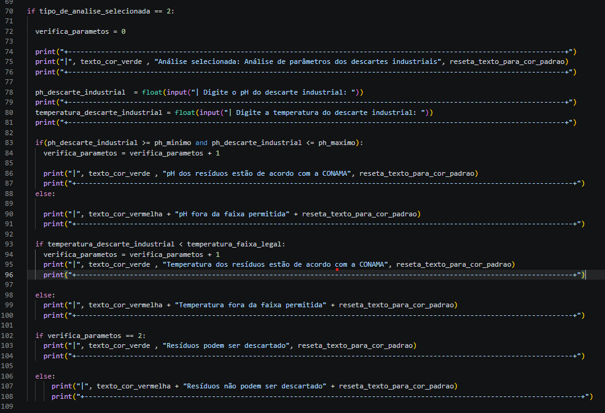

# Alerta de Escassez Hídrica e Verificador de Conformidade de Efluentes

Atividade avaliativa 1 do curso de Introdução à Computação.

## Objetivos

O script possui dois objetivos principais:

1. Receber parâmetros sobre um reservatório, analisar e retornar se a vazão e o nível estão respeitando um critério seguro.

2. Receber parâmetros sobre temperatura e pH de resíduos a serem descartados em um rio e verificar se respeitam os critérios da CONAMA.

---

## Explicação do Código

- A função print() será usada para exibir mensagens no terminal.
- A função input() é usada para receber os dados do usuário.
- A função int() realiza o casting do dado recebido, transformando-o em inteiro.
- A função float() realiza o casting do dado recebido, transformando-o em número de ponto flutuante.
- A condicional if irá comparar os dados.
- A confional else irá executar caso a condição if acima dela seja falsa.
- O operador lógico or verifica se alguma das condições é verdadeira; se uma delas for, toda a expressão será verdadeira.
- O operador lógico and verifica se ambas as condições são verdadeiras; se uma delas for falsa, toda a expressão será falsa.

### Tabela de cores

O terminal interpreta essa sequência de caracteres como cores, aplicando cor ao texto; o intuito é apenas decorativo.

---

### Variáveis globais

As variáveis globais do código são utilizadas para armazenar os dados que serão usados ao longo do programa, como constantes que representam valores máximos e mínimos de determinada grandeza e valores inseridos pelo usuário que serão analisados.

---

### Cabeçalho 

O cabeçalho do programa irá instruir de forma simples o usuário. Por meio dos print(), organizamos as informações a serem exibidas no terminal, apresentando o projeto e as possíveis opções de análise. A função input() recebe o tipo de análise de interesse do usuário, enquanto a função int() realiza o casting desse dado, transformando-o em um valor inteiro.

---

### Analise do reservatorio

O script retorna o tipo de análise selecionada pelo usuário e solicita os dados de nível e vazão do reservatório a ser analisado. Ao final, por meio das condicionais if, verifica se os dados recebidos estão de acordo: se a vazão estiver abaixo da crítica ou se o nível estiver abaixo do nível crítico, é exibida uma mensagem de erro.

Caso os valores estejam acima dos limites, uma mensagem de status OK será exibida e o código será encerrado.

---

### Analise do efluente 

Caso o usuário selecione o segundo tipo de análise, será exibida a análise escolhida para reafirmar a opção, e serão solicitados os dados dos resíduos, como pH e temperatura. Esses dados serão analisados de acordo com os parâmetros da CONAMA.
Caso estejam de acordo, o descarte será autorizado. Caso algum dos parâmetros esteja fora do padrão, será exibido qual parâmetro não está conforme, e a operação de descarte será bloqueada.

---

